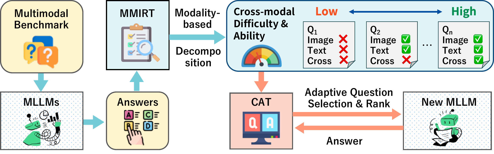

# M3IRT (Multimodal Multidimensional Multimedia IRT)

Codes and datasets for the paper:

> **[Evaluating Cross-Modal Reasoning Ability and Problem Characteristics with Multimodal Item Response Theory](https://arxiv.org/abs/2603.02663)**  
> Shunki Uebayashi, Kento Masui, Kyohei Atarashi, Han Bao, Hisashi Kashima, Naoto Inoue, Mayu Otani, Koh Takeuchi  
> *International Conference on Learning Representations (ICLR) 2026*

## Approach
M3IRT learns the characteristics of both VLMs and benchmark problems.
Using the learned characteristics, it can extract a subset of problems that are suitable for evaluating the cross-modal ability of VLM.


## Installation

This project requires **Python 3.12.6 or higher**. While `pip` can be used, we recommend using [`uv`](https://docs.astral.sh/uv/) for faster environment setup and dependency management.

### Installation with `uv`

1. If you haven't installed `uv` yet, run the following command:
   ```bash
   curl -LsSf https://astral.sh/uv/install.sh | sh
   ```
2. Move to the root directory of the repository:
   ```bash
   cd M3IRT
   ```
3. Initialize the environment and sync dependencies (install packages):
   ```bash
   uv sync
   ```
   *This will automatically create a virtual environment (`.venv`) and install all required dependencies listed in `pyproject.toml`.*

4. To run development or scripts, use `uv run` or activate the virtual environment:
   ```bash
   source .venv/bin/activate
   ```

## Usage

### 1. Python API

`M3IRT` and `M2IRT` classes can be imported directly into Python code. For detailed usage examples, see [`example_code/estimate.py`](example_code/estimate.py) and [`example_code/cat.py`](example_code/cat.py).

#### 1.1 Model Estimation

You can train the model and get parameter estimates (ability θ, discrimination a, difficulty b) by calling `train` and `estimate`.

```python
import pandas as pd
from m3irt.models.m3irt import M3IRT

# 1. Load response data (answer results)
normal_df = pd.read_csv("responses/mmmu/normal_mmmu.csv", index_col=0)
shuffled_df = pd.read_csv("responses/mmmu/shuffled_mmmu.csv", index_col=0)

# 2. Initialize M³-IRT model (enable scale value grid search)
model = M3IRT(
    normal_df,
    shuffled_df=shuffled_df,
    lr=0.001,
    max_epochs=500,
    scale_list=[2, 4, 8, 16],
    device="cpu", # or "cuda"
)

# 3. Train the model (using train/test data split)
model.train(train_percentage=0.95, test_percentage=0.05, seed=42)

# 4. Get parameter estimates (ability θ, discrimination a, difficulty b)
estimates = model.estimate()
print(pd.DataFrame.from_dict(estimates["theta"], orient="index").head())
```

#### 1.2 CAT Experiment

The [Computerized Adaptive Testing (CAT)](https://en.wikipedia.org/wiki/Computerized_adaptive_testing) simulation (`cat` method) evaluates adaptive testing given a dataset ([Han, 2018](https://doi.org/10.3352/jeehp.2018.15.7); [Mulder & van der Linden, 2009](https://doi.org/10.1007/s11336-008-9097-5)). (A standalone initial training is not required before calling `cat`, as the CAT simulation process trains dynamically or utilizes pre-configured estimation logic internally according to the model).

```python
import pandas as pd
from m3irt.models.m3irt import M3IRT

# 1. Load response data
normal_df = pd.read_csv("responses/mmmu/normal_mmmu.csv", index_col=0)
shuffled_df = pd.read_csv("responses/mmmu/shuffled_mmmu.csv", index_col=0)

# 2. Initialize M³-IRT model 
model = M3IRT(
    normal_df,
    shuffled_df=shuffled_df,
    lr=0.001,
    max_epochs=500,
    scale_list=[2, 4, 8, 16],
    device="cpu"
)

# 3. Run CAT (Adaptive Testing)
cat_results = model.cat(
    extraction_range=(1, 50), # Evaluate at 1% to 50% milestones
    seed=42
)
print(cat_results.head())
```

To run the sample scripts, execute the following commands:
```bash
uv run python example_code/estimate.py
uv run python example_code/cat.py
```

### 2. CLI for estimation

`m3irt-estimate` trains `M3IRT` or `M2IRT` from a YAML config and exports the estimated parameters to `result/` by default.

```bash
uv run m3irt-estimate --config config/estimate/mmmu_m3irt.yaml
```


The command writes:

- `result/estimates_<dataset>_theta.csv`
- `result/estimates_<dataset>_items.csv`

Estimate parameters, dataset options, and training settings can be defined via a YAML file. Example configs:

- [`config/estimate/mmmu_m3irt.yaml`](config/estimate/mmmu_m3irt.yaml)
- [`config/estimate/mathvista_m3irt.yaml`](config/estimate/mathvista_m3irt.yaml)
- [`config/estimate/seedbench_m3irt.yaml`](config/estimate/seedbench_m3irt.yaml)

The estimate YAML uses these sections:

```yaml
dataset:
  name: mmmu
  normal_csv: responses/mmmu/normal_mmmu.csv
  shuffled_csv: responses/mmmu/shuffled_mmmu.csv

model:
  type: m3irt

training:
  lr: 0.001
  batch_size: 512
  max_epochs: 5000
  device: cpu
  eps: 0.001

grid_search:
  scale_list: [2, 4, 8, 16]

experiment:
  seed: 42
  output_dir: result
  cuda_device: 0
```

### 3. CLI for CAT experiments

A CLI wrapper command `m3irt-cat` is provided to run CAT experiments using YAML configuration files. Processing is parallelized using `ray` in the background.

#### Run with a configuration file

```bash
uv run m3irt-cat --config config/cat/mmmu_m3irt.yaml
```
*(If you have already activated the virtual environment, you can simply run `m3irt-cat ...`)*

#### YAML configuration file

CAT parameters, dataset options, and model configurations can be defined via a YAML file, ensuring reproducibility. For example, `config/cat/mmmu_m3irt.yaml` configures the experiment for the MMMU dataset:

Example CAT configs:

- [`config/cat/mmmu_m3irt.yaml`](config/cat/mmmu_m3irt.yaml)
- [`config/cat/mathvista_m3irt.yaml`](config/cat/mathvista_m3irt.yaml)
- [`config/cat/seedbench_m3irt.yaml`](config/cat/seedbench_m3irt.yaml)

```yaml
dataset:
  name: mmmu
  normal_csv: responses/mmmu/normal_mmmu.csv
  shuffled_csv: responses/mmmu/shuffled_mmmu.csv

model:
  type: m3irt          # m3irt | m2irt

training:
  lr: 0.001
  batch_size: 512
  max_epochs: 5000
  device: cpu

grid_search:
  scale_list: [2,4,8,16] # Max scale for M3-IRT

cat:
  extraction_range: [1, 50]    # evaluate at 1% to 50%
  update_lr: 0.0001
  update_max_epochs: 100

experiment:
  seed: 42
  output_dir: result
  cuda_device: 0 # If you have a GPU, set it here

```

## Datasets

This repository contains the VLMs' responses to the MMMU, MathVista, and SEED-Bench datasets. The responses are stored in the `responses` directory. The datasets are as follows:

- **MMMU** (`responses/mmmu/`)
- **MathVista** (`responses/mathvista/`)
- **SEED-Bench** (`responses/seedbench/`)

For each dataset, we provide both the standard response data (`normal_*.csv`) and the response data corresponding to logically shuffled questions (`shuffled_*.csv`).

The response data (binary 0/1 correctness) in `responses/` is our original compilation and is released under this repository's MIT License. It does not contain any original content (questions, images, or answer choices) from the source benchmarks. The source benchmarks are available under their respective licenses:

- **MMMU**: [Apache-2.0](https://github.com/MMMU-Benchmark/MMMU/blob/main/LICENSE) ([HuggingFace](https://huggingface.co/datasets/MMMU/MMMU))
- **MathVista**: [CC BY-SA 4.0](https://choosealicense.com/licenses/cc-by-sa-4.0/) ([HuggingFace](https://huggingface.co/datasets/AI4Math/MathVista))
- **SEED-Bench**: [CC BY-NC 4.0](https://spdx.org/licenses/CC-BY-NC-4.0) ([HuggingFace](https://huggingface.co/datasets/AILab-CVC/SEED-Bench))

## Project structure

- `src/m3irt/`: Main package containing model core logic, CLI modules, etc.
   - `src/m3irt/models/`: Model classes for M2IRT and M3IRT. These classes can be used for estimation and CAT experiments.
   - `src/m3irt/irt_core/`: Core IRT logic and utilities. These classes are used by the model classes.
   - `src/m3irt/utils/`: Utility functions for data processing, masks, etc.
- `config/`: Configuration files (YAML) for CAT experiments, etc.
- `example_code/`: Sample code showing how to use the package API and execution flow.
- `responses/`: Input datasets for model training and evaluation (normal, shuffled).
- `result/`: Default directory for CAT results (CSV logs, etc.).

## Citation

If you find this work useful, please cite our paper:

```bibtex
@inproceedings{uebayashi2026m3irt,
  title={Evaluating Cross-Modal Reasoning Ability and Problem Characteristics with Multimodal Item Response Theory},
  author={Uebayashi, Shunki and Masui, Kento and Atarashi, Kyohei and Bao, Han and Kashima, Hisashi and Inoue, Naoto and Otani, Mayu and Takeuchi, Koh},
  booktitle={International Conference on Learning Representations (ICLR)},
  year={2026}
}
```

## License

This project is licensed under the MIT License - see the [LICENSE](LICENSE) file for details.
